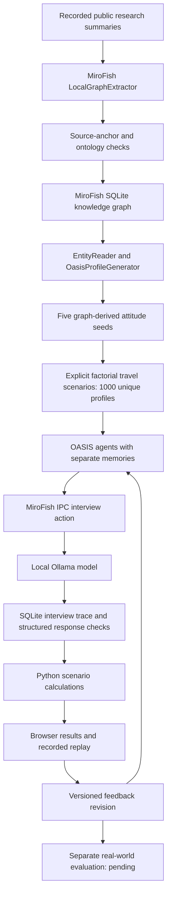

# Current travel-study architecture

Updated 20 September 2026. Supersedes the earlier disconnected-MiroFish prototype diagram for this workflow.

The research graph and the OASIS agent graph are distinct. The former holds source-derived entities and relationships. The latter holds simulation agents; this study uses separate interviews and does not connect them through social influence rounds.

MiroFish-local replaces the upstream Zep service with its own SQLite graph store. No external graph account or paid model provider is configured. Graph extraction and profile generation run through the installed fork's real service classes; General Learning adds provenance checks, a transparent scenario design and the demo interface.

Read `product/prototype/RUN-MIROFISH.md` for installation and inference limits. The 1,000-person execution result is recorded in `product/prototype/GRAPH-VERIFICATION.md` when complete.
