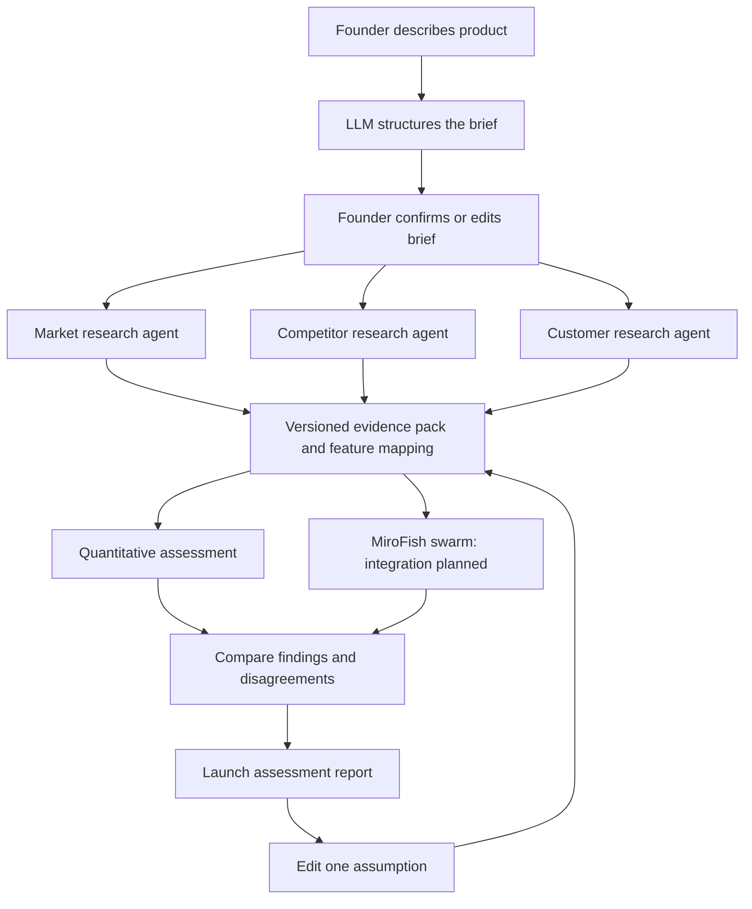

# Build plan: consumer SaaS launch assessment

Status: agreed product direction; implementation plan, not completed functionality.
Updated: 19 September 2026.

This is the current build brief. It supersedes the product scope in HANDOFF.md, PROJECT.md, ideating 2.md, the old architecture diagram and earlier pitch drafts. Existing code and data remain available as a baseline; their outputs are not newly validated by this decision.

## Decision and outcome

Build for founders assessing a consumer SaaS idea before launch. The headline question is: how promising is this product, for whom, and what would improve its launch prospects?

Keep the quantitative model and add research plus simulated customer reactions. The system discovers candidate audiences; the user need not supply one. The report combines commercial assessment, audience priorities, barriers and strategies to test. It must not shrink into only a price slider or a generic research summary.

Confirmed first category: note-taking and personal-productivity consumer SaaS. Proposed demo example, still to confirm: a tool turning personal voice notes into searchable notes and action lists. The founder is assessing whether to take the risk of pursuing the product, not only selecting an audience.

Confirmed intake: draft the interpreted product brief, then let the founder confirm or edit it. Confirmed research structure: market, competitor and customer agents run in parallel and feed one shared evidence pack. MiroFish is the selected swarm integration to investigate and build towards; feasibility, agent behaviour and its exact connection to the quantitative calculation remain open technical decisions. See the [team questionnaire](#team-questionnaire).

Done means:

1. A description produces a structured product brief, three candidate audiences and a source-backed assessment; a second unseen description can pass through the same pipeline without matching a preset product ID.
2. The report shows quantitative factors alongside explicitly synthetic reactions, traces important inputs to evidence or assumptions, and leaves unsupported factors unscored.
3. One changed launch assumption preserves the baseline and explains the resulting comparison. The working flow fits a 120-second video and a 90-second pitch.

These are proposed implementation acceptance checks under the approved direction. No application build is authorised or claimed by this documentation change.

## Layering and data flow

### 1. Intake and interpretation

Required: product description, intended problem and core benefit. Extract these from free text before requesting more information. Optional: monthly price, launch geography, existing alternatives, audience hypothesis, distribution channel and budget.

Output a ProductBrief with product summary, category, use case, pricing, geography, assumptions and unanswered questions. The founder must confirm or edit the interpreted brief. Whether retrieval may start speculatively before confirmation is an open question; the recommended default is to wait, avoiding wasted calls on a misinterpreted idea. Unknown price or geography remains unknown; a scenario may supply an explicitly labelled assumption. An out-of-scope idea gets a clear scope message.

Use an existing LLM with schema-validated structured output. Do not train a language model for this prototype. Treat retrieved pages as source material, never execution instructions.

### 2. Research and audience discovery

Three specialist agents run concurrently after the brief is confirmed (recommended timing; final answer in Q4):

| Agent | Responsibility | Returned output |
| --- | --- | --- |
| Market | Demand, category trend, saturation and market-size estimates where supported | Findings, dates, sources, conflicting evidence and unknowns |
| Competitor | Alternatives, prices, releases, differentiation and possible product stagnation | Comparable products, source-backed changes and gaps |
| Customer | Problems, preferences, switching barriers, willingness-to-pay evidence and candidate groups | Audience hypotheses, observed complaints and limits |

A coordinator validates their structured output, deduplicates sources and records disagreement. Three agents repeating one source do not constitute three independent observations. Research agents are distinct from the simulated customer swarm.

Retrieve competitor product/pricing pages and relevant public reviews or discussions. Prefer original product pages for capabilities and prices. Reviews support observations about expressed experiences, not representative market demand.

Discover up to three candidate audiences from problems and use cases, rather than recycling the five historical segments. For the example, students, individual knowledge workers and creators are hypotheses to investigate, not hardcoded winners.

Each EvidenceItem records ID, URL, title, retrieved date, publication date where available, observation, supported claim, limitation and provenance. Each AudienceCandidate records its need, alternatives, selection rationale, evidence IDs and unknowns. Never infer population percentages from the number of retrieved reviews.

Cache the evidence pack for the recorded demo. A cache must preserve sources and retrieval dates and be visibly labelled. New ideas may require fresh retrieval; do not silently reuse an unrelated cached assessment.

### 3. Quantitative assessment

Reuse product/quant/score_engine.py and weights.yaml as a baseline, with an adapter for new product and audience records. Existing weights are published assumptions, not fitted coefficients. The legacy sigmoid output is a heuristic, not a calibrated adoption probability.

Map each factor to its value or null, evidence IDs, rationale and provenance: observed, inferred, user-supplied or assumed. Missing evidence is not zero. If the legacy scorer requires complete inputs, either run a fully disclosed assumption scenario or suppress its aggregate output; never silently impute missing values or renormalise weights.

Display supported factor scores, limiting factors and evidence coverage separately. Coverage measures completeness, not predictive confidence. A legacy aggregate, if shown, must be labelled an unvalidated model index without a percentage sign.

Review known price behaviour before enabling price comparisons: the existing prior blend can create counterintuitive results, and the price-fit rule has a boundary issue. Resolve or explain these through meaningful checks, rather than selecting a camera-friendly example. Do not tune weights merely to obtain the desired winner.

Do not multiply a broad market population by the legacy score to claim expected customers. Reach, acquisition, conversion and retention are separate quantities.

### 4. Behavioural simulation

Use the same confirmed brief, audiences and evidence pack as the quant branch. MiroFish is the selected integration direction, not verified working functionality. Proposed initial behaviour: agents with explicit workflow, existing tools, budget and switching barriers evaluate ignore, try, pay or continue using. Independent versus socially interacting decisions, rounds, population size and the quant connection require team answers (Q10-Q12). A proposed smoke test uses two agents per audience across three audiences; this is an engineering test, not a representative sample.

Each reaction includes audience ID, scenario ID, possible motivation, objection, switching trigger and supporting evidence IDs. Distinguish cited observation from invented reaction. Outputs are hypotheses, not interviews or observed behaviour. No claim that four positive reactions out of six means 67% adoption.

Its existing social simulation requires adaptation for SaaS decisions. Proposed integration gate: within 30 minutes, demonstrate a small actual run, structured outputs, measured usage and a viable connection to the quant model. The team must decide in Q13 what to do if that fails. Do not silently replace the selected MiroFish approach or claim a simpler LLM reaction layer is MiroFish.

Recommended quant connection, not yet agreed: Python remains the deterministic calculator; agents propose traceable scenarios and invoke it through an adapter. Alternative: simulated transitions become model inputs, which requires new behavioural rules and calibration. Neither approach turns simulated purchase counts into observed demand.

### 5. Comparison and report

Combine evidence and reasoning, not scores from incompatible systems. Never average synthetic approval into the quantitative index or count shared evidence twice. A simulated objection may propose a new assumption scenario; it cannot silently change a measured input.

Report sections:

- Commercial outlook: whether the idea merits further investment of the founder's time, what appears promising, limiting factors and unresolved evidence. The report advises; it does not guarantee an outcome.
- Candidate audiences: ranked where evidence supports comparison, otherwise tied or insufficient evidence, with explanations.
- Competitors and alternatives: cited strengths, gaps and switching barriers.
- Synthetic reactions: possible motivations and objections, clearly labelled.
- Launch scenarios: baseline and one alternative with changed inputs and explained consequences.
- Recommended tests: who to interview, what proposition to test and what result would change the assessment.

The research and report must consider the following agreed factor areas. Not every factor belongs in the numeric model or has a measurable public-data input:

| Factor area | Question |
| --- | --- |
| Problem strength | How frequent and painful is the problem? |
| Demand trend | Is category interest growing, stable or declining? |
| Customer priorities | What benefits, features and complaints recur? |
| Willingness to pay | What evidence supports payment for this benefit? |
| Priority audiences | Who has the strongest need and fewest barriers? |
| Competitive activity | What are alternatives launching, changing or discontinuing? |
| Saturation | How many substitutes exist, including free and bundled tools? |
| Differentiation | Why would someone choose this product? |
| Overlooked opportunities | Which needs or workflows appear underserved? |
| Switching barriers | What habits, data or integrations must change? |
| Acquisition feasibility | Where could users be reached and on what assumptions? |
| Retention potential | Is there a recurring reason to keep using it? |
| Competitor stagnation | Do dated releases and complaints indicate unresolved needs? |
| Commercial viability | Could pricing cover service and acquisition costs? |
| Execution risk | What dependencies and reliability requirements could undermine delivery? |
| Evidence strength | What is observed, inferred, assumed or missing? |

Keep slowing category demand separate from competitor product stagnation. Sparse updates alone do not prove decline, and review growth alone does not prove customer growth.

Strategies are suggestions to test, not proven causal improvements. Disagreement between branches is useful output and must not be rewritten into artificial agreement.

## Success benchmark and forecasting boundary

Product ambition: forecast early commercial traction for a consumer SaaS launch. Proposed future outcome: active paying subscribers at month six, supported by month-six recurring revenue and three-month retention. These need an observable cohort and a defined launch date. They are not yet validated outputs.

Immediate prototype: evidence-backed assessment and conditional scenarios. If numerical commercial scenarios are shown, require explicit reachable audience, trial conversion, paid conversion and retention assumptions, plus time period. Show low/base/high assumption cases, not statistical confidence intervals. If inputs are missing, omit the totals.

Data gate: find historical launches with genuinely pre-launch features and later outcomes, including weak launches. Public review ratings and volume are not substitutes for subscriber, revenue or retention labels. If adequate outcome data is unavailable, retain an unvalidated assessment and state the forecasting work remains open.

Later evaluation: split by product and launch date, keep later launches held out, remove post-launch information and account for LLM knowledge leakage. Compare a simple category baseline, the current quant model and quant plus simulation. Evaluate outcome error and, for any binary milestone probability, calibration and Brier score. Add simulation to the prediction path only if held-out evidence supports it. One historical reveal is a demo, not validation.

## Build sequence and ownership

Budget assumption: roughly six focused hours including recording. This is a work allocation, not a fresh extension to the hackathon deadline of 20 September, 10:00 HKT.

| Work block | Deliverable | Suggested owner |
| --- | --- | --- |
| First 30 minutes | Answer blocking questionnaire items, freeze schemas, example and evidence sources; inspect current app/runtime before choosing a stack | Integrator + research |
| Next 90 minutes | Evidence pack and brief/audience extraction; quant adapter; UI shell built in parallel by teammates | Research, quant, frontend |
| Next 90 minutes | MiroFish integration gate and agreed swarm scope, synthesis and source inspection; connect end to end | Integrator + frontend |
| Next 60 minutes | Baseline comparison, missing-data handling, cost limits and meaningful checks | Quant + integrator |
| Final 90 minutes | Rehearse, record 120-second video, finish two slides and practise 90-second pitch | Team |

These are roles, not assignments to named teammates. No agents or teammates have been dispatched by this document. Codex can prepare evidence, schemas, adapters, UI and checks once implementation is requested. Jason owns the remaining product decisions, example acceptance, credentials or paid-service limits, team assignments and pitch delivery. Teammates can record independent answers in the questionnaire before Jason and the relevant technical owner resolve differences.

Reuse the current Python scorer and brand assets. Preserve a working app stack if one exists; avoid rebuilding infrastructure. Use the team's available model provider behind a server-side adapter, with keys outside the repository. No accounts, billing, fine-tuning or database required for this demo.

Proposed smoke-test cap: three audiences and six agents; final agents, rounds, call limits and latency target are to be agreed in Q11 and Q15. Cache expensive steps by brief, evidence version, model version and scenario. Limit retries and concurrent requests. Log calls, latency and usage; do not buy credits or exceed a newly chosen spend cap without approval. A numeric API budget remains to be supplied.

## Verification and failure behaviour

- Structured extraction rejects malformed responses and allows the founder to correct the interpretation.
- A new description produces new brief/audience reasoning; demo fixtures do not impersonate fresh retrieval.
- Important report claims resolve to evidence IDs, and missing inputs remain visible.
- Repeating identical quant inputs yields identical results. Check sensible boundary behaviour for price changes before exposing that control.
- Synthetic responses cannot write into evidence or quantitative input fields without a separately labelled scenario.
- Changing one field preserves the baseline and invalidates only affected cached work.
- Retrieval failure shows unavailable or dated cached evidence. A simulation failure leaves the quant/evidence view usable without fabricated reactions.
- No secrets appear in browser bundles, logs, screenshots or committed files.

## Demo and pitch

120-second video: 0-15 idea and promise; 15-35 interpretation and discovered audiences; 35-60 factors and a source; 60-80 synthetic objections and any disagreement; 80-105 one scenario comparison; 105-120 next test and honest limitation.

90-second pitch: 0-10 promise; 10-25 input and discovered audiences; 25-50 assessment and evidence; 50-70 reaction plus comparison; 70-90 recommendation and what is actually built. Use two slides around the product. Findings come from the recorded run, not a preselected surprise.

Proposed cut order: extra audiences/rounds, live retrieval during recording, numerical commercial scenarios without supported inputs, export polish. A MiroFish fallback requires the team decision in Q13, rather than an automatic scope change. Preserve idea interpretation, evidence, quant factors, clearly labelled reactions and one useful recommendation.

## Team questionnaire

The questions below complete the technical build plan. Consumer SaaS, note-taking/personal productivity, founder-first assessment, draft-and-confirm intake, three parallel research agents and the MiroFish integration direction are already agreed. Do not reopen those choices unless new feasibility evidence requires it.

Recommendations are proposals, not team answers. Everyone may disagree and should state why. “Unknown; owner to investigate” is a valid answer. Never paste credentials into this file.

Answer Q1-Q4, Q8, Q10-Q15 and Q18 before locking the implementation. Other questions can use the stated provisional defaults once the team accepts them. Jason can answer the product choices; technical teammates can answer integration, data, stack and budget questions. No teammate answers have been collected yet.

### Product and intake

**Q1. Which exact product will we use for the first demo, and what is the core benefit?**
Recommendation: personal voice notes converted into searchable notes and action lists. Define one benefit in one sentence and choose a second unseen description for a generalisation check.
Suggested respondents: Jason + product/frontend owner.

**Q2. What observable outcome and timeframe do we mean by success?**
Recommendation: month-six active paying subscribers, supported by recurring revenue and retention. Any subscriber threshold must come from the founder's goal or credible comparable data, not an invented universal benchmark. Is this the intended forecast target even if the demo initially shows only an unvalidated assessment?
Suggested respondents: Jason + quant/data owner.

**Q3. What launch geography, language and initial product stage should we assume?**
Recommendation: English-language consumer software, geography explicit in the brief, with an idea/prototype as input. Avoid claiming global demand from English-language evidence. Which geography should the demo use?
Suggested respondents: Jason + research owner.

**Q4. What information must the founder confirm before research starts?**
Recommendation: product/problem/core benefit confirmed; price, audience, channel and budget may remain unknown. Ask at most three critical follow-ups. Start paid research only after confirmation, rather than speculatively while the founder edits.
Suggested respondents: Jason + frontend/integration owner.

### Research and evidence

**Q5. Which data sources can we actually access through our existing tools?**
Recommendation: competitor sites/pricing/release notes and accessible public reviews/discussions. Record the retrieval provider, accessible sources and failure handling. No new scraper project for the hackathon. Which sources or APIs do teammates already have working?
Suggested respondents: research/integration owner.

**Q6. How should the system discover and compare audiences?**
Recommendation: up to three need-based groups, with current workflow, alternatives, budget assumptions and evidence IDs. Do not infer demographic populations or default to the old five segments. Should founders be able to edit these groups before simulation?
Suggested respondents: Jason + research/quant owners.

**Q7. What evidence should support trend and stagnation claims?**
Recommendation: dated comparable observations across an explicit period; use a proposed six-month window where available. Return insufficient evidence when the time series is missing. Do we have release histories or demand signals that make this feasible?
Suggested respondents: research/data owner.

### Quantitative model and success claims

**Q8. Which existing quant features can we support, and how should missing ones affect the result?**
Recommendation: retain the current model as a baseline, map evidence to features with provenance, show unscored factors, and suppress an aggregate requiring unsupported inputs unless a labelled assumption scenario is supplied. Quant owner should identify reusable code and known boundary issues to fix before comparison.
Suggested respondents: quant owner + Jason for the visible behaviour.

**Q9. What should the headline assessment display before probabilities are validated?**
Recommendation: promising/mixed/weak/insufficient evidence with reasons and a separate evidence-completeness indicator. A numeric model index can be secondary and explicitly unvalidated. A genuine probability requires an outcome dataset and calibration; a team preference cannot establish that evidence. Is the proposed initial display acceptable?
Suggested respondents: Jason + quant/frontend owners.

### MiroFish and the swarm

**Q10. How exactly should MiroFish connect to the quant model?**
Option A, recommended: agents propose structured assumption scenarios and call a deterministic Python scoring tool. Option B: agent purchase/retention decisions become quantitative inputs, requiring new behavioural rules and validation. Option C: independent quant and swarm branches meet only in the report. Which architecture does the team want, and can the adapter be built in time?
Suggested respondents: Jason + MiroFish/quant/integration owners.

**Q11. What does each agent do, and how large is the first run?**
Recommendation: profiles describe workflow/current tool/budget/switching barriers; agents evaluate ignore/try/pay/continue using. Start with six agents across three audiences and one decision round, then expand only if latency/cost permit. A decision round is not automatically a month of real behaviour. What actions, agent count and rounds can the implementation support?
Suggested respondents: MiroFish owner + Jason.

**Q12. Do agents decide independently or influence one another?**
Recommendation: independent decisions first. Social influence needs explicit contact structure, exposure rules and additional rounds. If interactions are essential, which ones: recommendations, public reviews or discussion, and why are they needed for the demo?
Suggested respondents: Jason + MiroFish owner.

**Q13. What should happen if the actual MiroFish integration fails the feasibility check?**
Recommendation: a 30-minute gate with a real bounded run and measured usage. Team chooses whether to reduce MiroFish scope, accept a clearly named simpler reaction layer, or reduce other features to retain MiroFish. No silent substitution. Which fallback is approved and who makes the call?
Suggested respondents: Jason + MiroFish/integration owners.

### Runtime, delivery and validation

**Q14. What already runs, and which stack/provider should we preserve?**
Recommendation: keep the working frontend/backend, wrap the existing Python scorer, and use structured LLM outputs behind a server-side adapter. List the current branch/runtime, model/retrieval providers, MiroFish setup status and interface contracts. Confirm access exists without sharing secret values.
Suggested respondents: frontend/integration/MiroFish owners.

**Q15. What are the hard cost and latency limits?**
Recommendation: agree a total remaining API spend cap, per-assessment call/token limits and a wait-time target before running the swarm. Show progressive results and allow cancellation; label cached results. Budget amount/currency, available credits and acceptable wait must come from the team.
Suggested respondents: Jason + account/integration owner.

**Q16. What is the final report's decision and comparison experience?**
Recommendation: top-level outlook, three limiting factors and three tests, followed by competitors, audiences, evidence and reactions. Preserve the baseline and change one input at a time: price, feature proposition or channel. Which comparison should the demo show? Recommendations must explain assumptions rather than promise an uplift in success odds.
Suggested respondents: Jason + frontend/quant owners.

**Q17. What can we genuinely validate before submission?**
Recommendation: one recorded example plus one unseen idea; traceable citations, visible missing data, quant repeatability and boundaries, real MiroFish run if claimed, and a truthful cached fallback. Audit historical outcomes separately. Do any teammates have launch data with pre-launch inputs and later subscriber/revenue outcomes? If not, accept that predictive accuracy remains unvalidated.
Suggested respondents: data/quant/integration owners + Jason.

**Q18. Who owns each deliverable, and how much time remains?**
Recommendation: name owners for research/data, quant, MiroFish/integration, frontend, and pitch/video; agree an integration cutoff and recording cutoff before the submission deadline. Recheck the six-hour assumption against actual availability. Who owns each role, who resolves conflicts, and where should answers be collected?
Suggested respondents: everyone; Jason resolves product scope.

### Team answer sheet

Each teammate adds their own answer below using name + choice + reason. Keep differing answers visible until resolved. The “agreed decision” column stays pending until the relevant owner and Jason resolve it. Do not treat silence as agreement. Add links to evidence or working code where relevant.

| Question | Jason's answer | Teammate answers (name: answer + reason) | Agreed decision / owner |
| --- | --- | --- | --- |
| Q1 | Pending | Pending | Pending |
| Q2 | Pending | Pending | Pending |
| Q3 | Pending | Pending | Pending |
| Q4 | Pending | Pending | Pending |
| Q5 | Pending | Pending | Pending |
| Q6 | Pending | Pending | Pending |
| Q7 | Pending | Pending | Pending |
| Q8 | Pending | Pending | Pending |
| Q9 | Pending | Pending | Pending |
| Q10 | Pending | Pending | Pending |
| Q11 | Pending | Pending | Pending |
| Q12 | Pending | Pending | Pending |
| Q13 | Pending | Pending | Pending |
| Q14 | Pending | Pending | Pending |
| Q15 | Pending | Pending | Pending |
| Q16 | Pending | Pending | Pending |
| Q17 | Pending | Pending | Pending |
| Q18 | Pending | Pending | Pending |

Answer format for a chat reply: question number, your answer, one reason, and any dependency. Answer the questions relevant to your role; mark others “no preference” or “needs investigation”. The integrator can copy answers into this table without changing their meaning.

Consumer SaaS is fixed as the route. These questions settle implementation and honest output claims. The application has not been built by this planning change.
