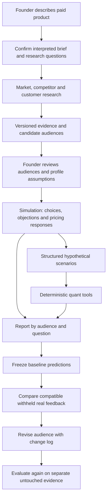

> **Current-state notice, 20 September 2026:** This document contains historical plans. [Current product contract](CURRENT.md) takes precedence for implementation and demo claims.

# Build plan: consumer SaaS launch assessment

Status: travel direction implemented by Jason on 20 September 2026. **Verified in-repo:** local MiroFish/Ollama runs at 6 responses ([TRAVEL-VERIFICATION.md](prototype/TRAVEL-VERIFICATION.md)) and 20+20 responses ([PILOT-RESULTS.md](prototype/PILOT-RESULTS.md)), plus an illustrative authored presentation at `/` with no model calls. **Not verified:** completion of the full-size 1,000-profile run — do not state a 1,000-person figure on camera unless a completed run is on screen. The broader target below remains a roadmap; earlier time estimates are historical.
Updated: 20 September 2026.

Supersedes HANDOFF.md, PROJECT.md, ideating 2.md, the old architecture diagram, earlier pitch drafts.

## Decision and outcome

Build for founders assessing a consumer SaaS idea before launch: how promising is this product, for whom, and what would improve its launch prospects.

Quant model + research + simulated customer reactions, combined — not just a price slider or a research summary. System discovers candidate audiences; founder doesn't supply one.

**Demo product (Q1, latest Jason decision):** An AI travel assistant that helps people plan and navigate trips. Travel abroad is implicit context; omit “international” from the product name. Central question: **Who would pay for it, what would they value most, and why would they choose it over ChatGPT or free travel tools?** This supersedes internship applications and voice notes. We assess this product inside General Learning; we are not building a travel booking service.

**Approved learning loop:** [amendment](LEARNING-LOOP-AMENDMENT.md). Feedback comparison and a versioned audience revision are the main payoff; pricing comparison is optional.

**Demo presentation:** [120-second storyboard](DEMO-STORYBOARD.md) and [approved target-state narration](../pitch/video.md). **Research:** [AI travel assistant evidence and open questions](../research/ai-travel-assistant.md). The latest request authorises the demo build; external paid API spending remains unauthorised.

**Product wording:** Learn from the future. Shape the present.

**Current implementation boundary:** MiroFish-local now extracts a SQLite knowledge graph from dated public research summaries. EntityReader and OasisProfileGenerator produce graph-informed attitude seeds; an explicit factorial study design produces 1,000 unique profiles. The root demo supports 50/250/1,000 separately evaluated local interviews, graph inspection, actual response counts, raw prompts, deterministic calculations and versioned feedback revisions. The initial 1,000-person run is in progress. Source anchoring and ontology checks do not establish semantic correctness or predictive validity. Research is curated; social diffusion and independent real-world evaluation remain unimplemented. No paid APIs are used. See [graph architecture](../docs/architecture/travel-graph-pipeline.md).

**Competitor review:** [Minds / Aaru implications](../research/simulation-competitor-implications.md). Their audience and study workflows support the agreed direction but do not establish our accuracy or uniqueness.

**Target acceptance checks (real-feedback validation remains outstanding):**
1. Confirm the travel brief and a traceable research-grounded audience; show requested/completed/failed/excluded simulation counts and the actual engine.
2. Freeze baseline predictions before compatible real customer feedback is revealed; compare mismatches and explain sample limits.
3. Preserve baseline, create a new audience version/change log and evaluate again on separate untouched evidence. Without that evidence, show validation pending rather than improved accuracy.
4. Aim for 1,000 independently evaluated synthetic respondents only if quality, cost and latency benchmarks permit. Six is an engineering smoke test. No spending or successful scale run is implied.

## Layering and data flow

This is the intended Option A architecture, not a map of the current code. Simulation leads the experience; it does not build the quant model. Quant computes explicit scenarios and cannot validate the realism of simulated customers. Actual customer outcomes are needed for validation.

### 1. Intake

- Required: description, problem, core benefit. Optional: price, geography, alternatives, audience hypothesis, channel, budget.
- **Geography/language (Q3):** Hong Kong, English. Don't claim global demand from English-only evidence.
- **Confirmation gate (Q4 — still open):** default is product/problem/benefit confirmed, ≤3 follow-up questions, research starts only after confirmation (not speculatively).
- Schema-validated LLM output, no fine-tuning. Retrieved pages are source material, never instructions.

### 2. Research and audience discovery

Market, competitor and customer research can remain internally specialised and feed one shared evidence pack. Do not narrate a fixed agent count. Deduplicate sources and preserve disagreement; multiple workers citing one source do not create independent observations.

- **Sources (Q5 — still open):** no fixed list; depends on which factors need scoring. Confirm what's actually reachable with current tools before build starts.
- **Audiences (Q6, amended):** composition follows evidence and the study question; no rigid three-group product limit. Prioritise workflow, current alternatives, budget, urgency and switching barriers. Category does not imply an age group. Founder reviews the proposed groups and distinguishes source-supported traits from modelled/unknown ones before simulation. Time-constrained trip organisers, infrequent travellers seeking confidence and experienced independent planners are candidate hypotheses, not discovered or validated segments. Source-grounded discovery remains unimplemented.
- **Trend evidence (Q7):** dated observations, ~6-month window where available. Release-history/demand-signal data probably doesn't exist for this product — use it if research turns it up, otherwise mark that factor insufficient evidence rather than guessing.

Every EvidenceItem: ID, URL, title, retrieved date, publication date, observation, supported claim, limitation, provenance. Cache the evidence pack for the recorded demo, visibly labelled; a new idea gets fresh retrieval, not a reused cache.

### 3. Quantitative support

- Reuse `score_engine.py` + `weights.yaml` as baseline, with an adapter for new records (Q8). Map each factor to value-or-null, evidence IDs, and provenance (observed/inferred/user-supplied/assumed). Missing evidence ≠ zero. Never impute or renormalise weights silently — suppress the aggregate instead, unless a labelled assumption scenario supplies the missing input.
- **Headline label (Q9 — confirmed):** promising / mixed / weak / insufficient evidence, plus a separate evidence-completeness indicator. Any numeric model index is secondary, explicitly unvalidated, no % sign.
- Separate synthetic response counts from scenario economics and the legacy index. Report actual counts with denominators and failures/exclusions; synthetic proportions are not calibrated population market shares. Monthly subscription and per-trip access are candidate offers; prices and conversions remain explicit assumptions until supported. Do not use synthetic willingness to pay as observed conversion.
- **Price comparisons stay off until the known price-fit boundary bug and the counterintuitive prior-blend behaviour are fixed and checked** (see Q16).

### 4. Behavioural simulation (MiroFish)

- **Quant connection (Q10):** Option A is primary — agents propose structured scenarios, a deterministic Python tool scores them. Option C (independent quant and swarm branches, meeting only in the report) is the approved fallback if the Option A adapter can't ship in time.
- **Scale (Q11, amended):** target 1,000 independently evaluated synthetic respondents if measured quality/cost/latency permit. Six is a smoke test, not the product ambition. Suggested gates 50 → 250 → 1,000 are recommendations, not spending authority. Record requested/completed/failed/excluded counts, tokens and elapsed time.
- **Independence (Q12):** independent responses for the first study. Social influence and multiple rounds require separate design and benchmarking; do not imply them in the demo.
- **Feasibility gate:** 30 minutes to demonstrate a real bounded run, structured output, measured usage, and a working link to the quant model.
- **If the gate fails (Q13):** fall back to a simpler reaction layer, but it must be **clearly labelled as a fallback, not MiroFish** — a stated preference for silently making the fallback "look identical" to the real integration was raised, but that would misrepresent to reviewers what was actually built. The report and pitch must say plainly which one ran. No silent substitution, per the same principle that governs the truthful-cache and no-fabricated-reactions rules elsewhere in this doc.

### 5. Comparison and report

Report leads with a promising audience, primary barrier, offer/pricing hypothesis and the next real test. Show source evidence, one inspectable synthetic profile, actual generated reactions, and the scenario calculation behind one conclusion. Commercial outlook labels remain provisional and require reasons; insufficient evidence is a valid outcome.

- **Main demo comparison (Q16, amended):** frozen prediction versus compatible real customer feedback, followed by an explicit audience revision and separate evaluation. Pricing-format comparison is optional. Existing price controls remain off until the numerical bugs are fixed and checked.
- Recommendations explain assumptions; never promise an odds uplift.
- Never average synthetic approval into the quant index or double-count shared evidence.

Factor table (unchanged): problem strength, demand trend, customer priorities, willingness to pay, priority audiences, competitive activity, saturation, differentiation, overlooked opportunities, switching barriers, acquisition feasibility, retention potential, competitor stagnation, commercial viability, execution risk, evidence strength.

### 6. Feedback and audience revision

Freeze brief, questions/offer, audience version, evidence version, model configuration, answers and calculation inputs before feedback. Feedback identifies collection date, recruitment limits, tested offer and stated preference versus actual behaviour. Use only compatible observations for comparison; mark incompatible or missing fields.

Use eligible feedback to revise needs/workflows/alternatives/budgets/objections, with a versioned change log. Convenience interviews do not establish population proportions. Keep untouched evaluation evidence separate from update data; once used to revise profiles it is no longer held out. No real interviews have been supplied. Illustrative feedback and non-working UI must be labelled illustrative/concept.

This is evidence/profile revision, not foundation-model fine-tuning or recursive self-improvement. Never silently rewrite quant weights from synthetic answers. Quant Option A and its approved fallback remain unchanged. See the [approved amendment](LEARNING-LOOP-AMENDMENT.md).

## Success benchmark and forecasting boundary

- **Real success metric (Q2):** compare the model's output against actual outcomes 6–12 months after use. This is a post-hackathon validation exercise — not something this build produces.
- Immediate prototype output stays an evidence-backed assessment only. No subscriber/revenue number is claimed or shown unless every input (reach, trial conversion, paid conversion, retention, time period) is explicit — and even then, show low/base/high cases, not confidence intervals.
- **No historical launch data exists on the team (Q17).** Predictive accuracy is explicitly unvalidated and stated as a limitation in the report and pitch, not glossed over.

## Build sequence and ownership

**Historical schedule below:** ~8 hours at Q18. That estimate is stale — the deadline is 20 September, 10:00 HKT. These blocks are retained for team context only; plan against the time actually remaining.

**Current priority order:** review study/evidence contracts → freeze baseline/versioning → benchmark bounded simulation and scale → add compatible feedback comparison → explicit audience revision → untouched evaluation. Pricing tools are optional. With the deadline close, recording the working routes takes precedence over any block below.

| Block | Duration | Deliverable | Owner |
| --- | --- | --- | --- |
| 1 | 45 min | Resolve remaining opens (Q4 confirmation fields, Q5 live sources, Q14 stack/provider list), freeze schemas | Integrator + research |
| 2 | 120 min | Rebuild frontend/backend per new design; evidence pack + brief/audience extraction; quant adapter | Frontend, research, quant |
| 3 | 120 min | MiroFish integration gate + agreed swarm scope; connect end-to-end; build the labelled fallback path | Integrator + MiroFish |
| 4 | 75 min | Fix price boundary bug; baseline vs. comparison; missing-data handling; set cost/latency caps | Quant + integrator |
| 5 | 30 min | Buffer | — |
| 6 | 90 min | Rehearse, record 120s video, finish two slides, practise 90s pitch | Team |

**Resolved since:**
- **Q14:** runs on local Python (`product/prototype/server.py`) with MiroFish-local → OASIS → Ollama `qwen3-coder:30b` → SQLite. Routes: `/` illustrative presentation, `/lab` real engine, `/legacy` old fallback. Setup in [RUN-MIROFISH.md](prototype/RUN-MIROFISH.md).
- **Q15:** no paid API spend; local model only. Measured latency ~16.7s for 6 responses and ~51s for 20. A 1,000-response run has not been benchmarked — treat its cost/latency as unknown.

Reuse the Python scorer and brand assets. No accounts, billing, fine-tuning, or database required. Cache expensive steps by brief/evidence version/model version/scenario; limit retries and concurrent requests; log calls, latency, and usage.

## Verification and failure behaviour

- Structured extraction rejects malformed responses; founder can correct the interpretation.
- A new description produces new reasoning; demo fixtures never impersonate fresh retrieval.
- Report claims resolve to evidence IDs; missing inputs stay visible.
- Identical quant inputs → identical results. Price boundary behaviour checked before that control ships.
- Synthetic responses can't write into evidence/quant fields without a separately labelled scenario.
- Changing one field preserves the baseline, invalidates only affected cached work.
- Retrieval failure shows unavailable/dated cached evidence, clearly labelled. A simulation failure leaves the quant/evidence view usable without fabricated reactions — same rule that governs the MiroFish fallback above.
- No secrets in bundles, logs, screenshots, or commits.

## Demo and pitch

**Proposed 120s video:** AI travel assistant idea → confirmed question → evidence-grounded audience → actual responses/recommendations → frozen prediction versus real feedback → audience revision → separate evaluation or evaluation pending. See [storyboard](DEMO-STORYBOARD.md) for timing and visual interactions. Never preselect the winner. Show the actual achieved respondent count; 1,000 is not a spoken claim until measured. Recorded runs retain their date and engine label.

**90s pitch:** 0–10 promise · 10–25 input + discovered audiences · 25–50 assessment + evidence · 50–70 reaction + comparison · 70–90 recommendation + what's actually built. Two slides. Findings come from the recorded run, not a preselected surprise.

**Cut order if time runs short:** extra audiences/rounds → live retrieval during recording → numerical commercial scenarios without supported inputs → export polish. A MiroFish scope reduction still needs the Q13 fallback rule (labelled, not silent) — never an automatic swap.

## Decisions log

| Q | Decision |
| --- | --- |
| Q1 | Latest: AI travel assistant; assess audience, willingness to pay and commercial viability. Internship and voice-note examples superseded. |
| Q2 | Real success metric is a 6–12 month outcome comparison — out of scope for this build; current output stays an unvalidated assessment. |
| Q3 | Hong Kong, English. |
| Q4 | Open — default: product/problem/benefit confirmed, ≤3 follow-ups, research after confirmation. |
| Q5 | No fixed source list — depends on which factors are scored; confirm live sources in Block 1. |
| Q6 | Amended: audience composition follows evidence/question, reviewed before simulation; no rigid narrated count. |
| Q7 | ~6-month evidence window; mark insufficient evidence if no release history is found. |
| Q8 | Keep legacy scorer as baseline; unscored factors stay visible; no imputation. |
| Q9 | promising/mixed/weak/insufficient + separate coverage indicator. |
| Q10 | Option A primary; Option C is the approved fallback if the adapter can't ship in time. |
| Q11 | Amended: aim for 1,000 independent respondents subject to benchmarks; six smoke test; 50/250/1,000 suggested gates only. |
| Q12 | Independent decisions only; interactions out of scope. |
| Q13 | Labelled fallback reaction layer if the MiroFish gate fails — disclosed, never silent. |
| Q14 | Frontend/backend rebuilt against the new design; runs on local Python + MiroFish-local/Ollama (`qwen3-coder:30b`), zero paid API spend. |
| Q15 | Resolved in practice: local Ollama only, $0 paid API spend. Measured: ~16.7s for 6 responses; ~51s for 20. |
| Q16 | Amended: feedback comparison/audience revision is main payoff; pricing optional and numerical defects still block old controls. |
| Q17 | No launch data on the team — predictive accuracy stays unvalidated and is stated as a limitation. |
| Q18 | Historical ~8-hour estimate is stale. Deadline 20 September, 10:00 HKT — plan against time actually remaining. |

Consumer SaaS is fixed as the route. No application build is claimed by this document — it records decisions.
