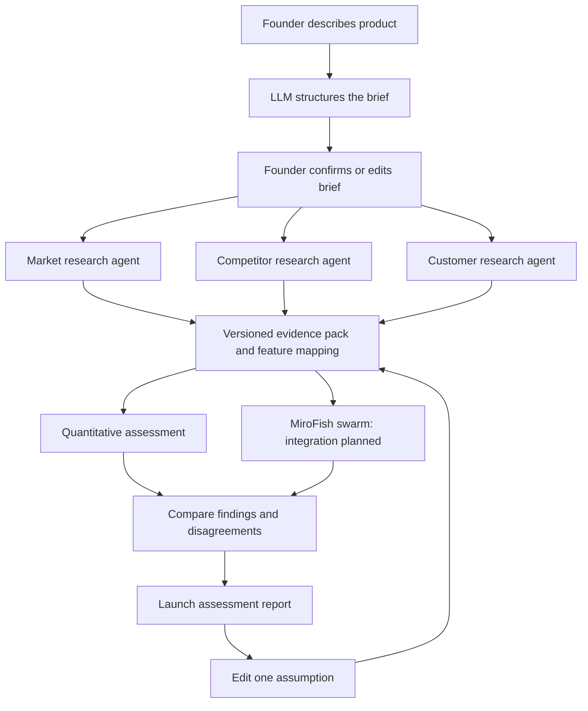

# Build plan: consumer SaaS launch assessment

Status: decisions locked from team Q&A. ~8 hours remain before submission.
Updated: 20 September 2026.

Supersedes HANDOFF.md, PROJECT.md, ideating 2.md, the old architecture diagram, earlier pitch drafts.

## Decision and outcome

Build for founders assessing a consumer SaaS idea before launch: how promising is this product, for whom, and what would improve its launch prospects.

Quant model + research + simulated customer reactions, combined — not just a price slider or a research summary. System discovers candidate audiences; founder doesn't supply one.

**Demo product (Q1):** Voicenotes-style app — voice notes → searchable notes and action items, modeled on the real product [voicenotes.com](https://voicenotes.com/). One-sentence core benefit and a second, unseen product description (for the generalisation check) still need picking before recording.

**Done means:**
1. A description produces a structured brief, 3 candidate audiences, a source-backed assessment; a second unseen description passes through without matching a preset ID.
2. Report shows quant factors alongside labelled synthetic reactions, traces inputs to evidence or assumptions, leaves unsupported factors unscored.
3. One changed assumption preserves the baseline and explains the comparison. Flow fits a 120s video and a 90s pitch.

## Layering and data flow

### 1. Intake

- Required: description, problem, core benefit. Optional: price, geography, alternatives, audience hypothesis, channel, budget.
- **Geography/language (Q3):** Hong Kong, English. Don't claim global demand from English-only evidence.
- **Confirmation gate (Q4 — still open):** default is product/problem/benefit confirmed, ≤3 follow-up questions, research starts only after confirmation (not speculatively).
- Schema-validated LLM output, no fine-tuning. Retrieved pages are source material, never instructions.

### 2. Research and audience discovery

Three agents (market, competitor, customer) run in parallel into one shared evidence pack. A coordinator dedupes sources and records disagreement — three agents citing one source isn't three observations.

- **Sources (Q5 — still open):** no fixed list; depends on which factors need scoring. Confirm what's actually reachable with current tools before build starts.
- **Audiences (Q6):** up to 3, need-based, not the old five segments. Founder can confirm/edit the discovered groups before simulation runs.
- **Trend evidence (Q7):** dated observations, ~6-month window where available. Release-history/demand-signal data probably doesn't exist for this product — use it if research turns it up, otherwise mark that factor insufficient evidence rather than guessing.

Every EvidenceItem: ID, URL, title, retrieved date, publication date, observation, supported claim, limitation, provenance. Cache the evidence pack for the recorded demo, visibly labelled; a new idea gets fresh retrieval, not a reused cache.

### 3. Quantitative assessment

- Reuse `score_engine.py` + `weights.yaml` as baseline, with an adapter for new records (Q8). Map each factor to value-or-null, evidence IDs, and provenance (observed/inferred/user-supplied/assumed). Missing evidence ≠ zero. Never impute or renormalise weights silently — suppress the aggregate instead, unless a labelled assumption scenario supplies the missing input.
- **Headline label (Q9 — confirmed):** promising / mixed / weak / insufficient evidence, plus a separate evidence-completeness indicator. Any numeric model index is secondary, explicitly unvalidated, no % sign.
- **Price comparisons stay off until the known price-fit boundary bug and the counterintuitive prior-blend behaviour are fixed and checked** (see Q16).

### 4. Behavioural simulation (MiroFish)

- **Quant connection (Q10):** Option A is primary — agents propose structured scenarios, a deterministic Python tool scores them. Option C (independent quant and swarm branches, meeting only in the report) is the approved fallback if the Option A adapter can't ship in time.
- **First run (Q11, Q12):** 6 agents across 3 audiences, 1 decision round, independent decisions (no cross-agent influence). Interactions (recommendations, reviews) need ≥2 rounds and are out of scope for this build.
- **Feasibility gate:** 30 minutes to demonstrate a real bounded run, structured output, measured usage, and a working link to the quant model.
- **If the gate fails (Q13):** fall back to a simpler reaction layer, but it must be **clearly labelled as a fallback, not MiroFish** — a stated preference for silently making the fallback "look identical" to the real integration was raised, but that would misrepresent to reviewers what was actually built. The report and pitch must say plainly which one ran. No silent substitution, per the same principle that governs the truthful-cache and no-fabricated-reactions rules elsewhere in this doc.

### 5. Comparison and report

Report sections unchanged: commercial outlook, candidate audiences, competitors/alternatives, synthetic reactions (labelled), launch scenarios (baseline + one alternative), recommended tests.

- **Demo comparison (Q16):** price, once the boundary bug is fixed and sanity-checked. If the fix isn't done in time, fall back to a feature-proposition comparison instead — don't ship an unfixed price comparison just to hit the video.
- Recommendations explain assumptions; never promise an odds uplift.
- Never average synthetic approval into the quant index or double-count shared evidence.

Factor table (unchanged): problem strength, demand trend, customer priorities, willingness to pay, priority audiences, competitive activity, saturation, differentiation, overlooked opportunities, switching barriers, acquisition feasibility, retention potential, competitor stagnation, commercial viability, execution risk, evidence strength.

## Success benchmark and forecasting boundary

- **Real success metric (Q2):** compare the model's output against actual outcomes 6–12 months after use. This is a post-hackathon validation exercise — not something this build produces.
- Immediate prototype output stays an evidence-backed assessment only. No subscriber/revenue number is claimed or shown unless every input (reach, trial conversion, paid conversion, retention, time period) is explicit — and even then, show low/base/high cases, not confidence intervals.
- **No historical launch data exists on the team (Q17).** Predictive accuracy is explicitly unvalidated and stated as a limitation in the report and pitch, not glossed over.

## Build sequence and ownership

**Budget: ~8 hours remain (Q18).**

| Block | Duration | Deliverable | Owner |
| --- | --- | --- | --- |
| 1 | 45 min | Resolve remaining opens (Q4 confirmation fields, Q5 live sources, Q14 stack/provider list), freeze schemas | Integrator + research |
| 2 | 120 min | Rebuild frontend/backend per new design; evidence pack + brief/audience extraction; quant adapter | Frontend, research, quant |
| 3 | 120 min | MiroFish integration gate + agreed swarm scope; connect end-to-end; build the labelled fallback path | Integrator + MiroFish |
| 4 | 75 min | Fix price boundary bug; baseline vs. comparison; missing-data handling; set cost/latency caps | Quant + integrator |
| 5 | 30 min | Buffer | — |
| 6 | 90 min | Rehearse, record 120s video, finish two slides, practise 90s pitch | Team |

**Open before Block 1 ends:**
- **Q14:** current branch/runtime, model/retrieval providers, MiroFish setup status, interface contracts — not yet documented. Note: rebuilding frontend/backend (rather than reusing the working stack) adds real risk against an 8-hour budget; worth a quick gut-check before committing the full 120 minutes in Block 2.
- **Q15:** total spend cap, per-assessment call/token limits, wait-time target before the swarm runs — no numbers supplied yet.

Reuse the Python scorer and brand assets. No accounts, billing, fine-tuning, or database required. Cache expensive steps by brief/evidence version/model version/scenario; limit retries and concurrent requests; log calls, latency, and usage.

## Verification and failure behaviour

- Structured extraction rejects malformed responses; founder can correct the interpretation.
- A new description produces new reasoning; demo fixtures never impersonate fresh retrieval.
- Report claims resolve to evidence IDs; missing inputs stay visible.
- Identical quant inputs → identical results. Price boundary behaviour checked before that control ships.
- Synthetic responses can't write into evidence/quant fields without a separately labelled scenario.
- Changing one field preserves the baseline, invalidates only affected cached work.
- Retrieval failure shows unavailable/dated cached evidence, clearly labelled. A simulation failure leaves the quant/evidence view usable without fabricated reactions — same rule that governs the MiroFish fallback above.
- No secrets in bundles, logs, screenshots, or commits.

## Demo and pitch

**120s video:** 0–15 idea/promise · 15–35 interpretation + discovered audiences · 35–60 factors + a source · 60–80 synthetic objections/disagreement · 80–105 one scenario comparison (price, if fixed in time — else feature) · 105–120 next test + honest limitation.

**90s pitch:** 0–10 promise · 10–25 input + discovered audiences · 25–50 assessment + evidence · 50–70 reaction + comparison · 70–90 recommendation + what's actually built. Two slides. Findings come from the recorded run, not a preselected surprise.

**Cut order if time runs short:** extra audiences/rounds → live retrieval during recording → numerical commercial scenarios without supported inputs → export polish. A MiroFish scope reduction still needs the Q13 fallback rule (labelled, not silent) — never an automatic swap.

## Decisions log

| Q | Decision |
| --- | --- |
| Q1 | Demo product: Voicenotes-style app (voicenotes.com). Core benefit sentence + second unseen idea: TBD before recording. |
| Q2 | Real success metric is a 6–12 month outcome comparison — out of scope for this build; current output stays an unvalidated assessment. |
| Q3 | Hong Kong, English. |
| Q4 | Open — default: product/problem/benefit confirmed, ≤3 follow-ups, research after confirmation. |
| Q5 | No fixed source list — depends on which factors are scored; confirm live sources in Block 1. |
| Q6 | ≤3 need-based audiences; founder confirms/edits before simulation. |
| Q7 | ~6-month evidence window; mark insufficient evidence if no release history is found. |
| Q8 | Keep legacy scorer as baseline; unscored factors stay visible; no imputation. |
| Q9 | promising/mixed/weak/insufficient + separate coverage indicator. |
| Q10 | Option A primary; Option C is the approved fallback if the adapter can't ship in time. |
| Q11 | 6 agents, 3 audiences, 1 round. |
| Q12 | Independent decisions only; interactions out of scope. |
| Q13 | Labelled fallback reaction layer if the MiroFish gate fails — disclosed, never silent. |
| Q14 | Rebuilding frontend/backend against new design (risk vs. 8h budget); stack/provider details still undocumented. |
| Q15 | Open — spend cap, per-call limits, wait target not yet set. |
| Q16 | Price comparison once the boundary bug is fixed; feature-proposition is the fallback comparison. |
| Q17 | No launch data on the team — predictive accuracy stays unvalidated and is stated as a limitation. |
| Q18 | ~8 hours remain; owners and blocks above. |

Consumer SaaS is fixed as the route. No application build is claimed by this document — it records decisions.
